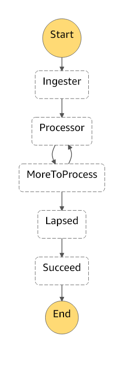

# Overview

This repository provides automation around syncing ActionKit CSV exports to ActionNetwork via API. It includes both the logic to sync the data as well as to manage the infrastructure.

## Bulk Mode (Offline)

[bulk.py](bulk.py) is the original, offline version of this sync. It expects two files to be added to the root dir named `older.csv` and `newer.csv`. The script will run and output differences as it syncs the data.

## Cloud Mode

The automated version runs in AWS. It's broken into a few different pieces to handle different parts of the process. The process is now coordinated by a step function.

Simple Email Service is set up to forward emails to a bucket. The step function gets triggered when an object gets put in an S3 bucket.

### Ingester

The Ingester reads the email message and converts the data into Items in the DynamoDB.

### Processor

The Processor reads unprocessed Items from the DynamoDB table in batches. This continues until there is no more work to do. The Processor only handles creating records for new and updating existing people. The custom field `is_member` gets marked `True`.

### Lapsed

The Lapsed process happens as a clean-up step. It looks for Items in the DynamoDB table that were present last week, but were no longer present in the current week. The custom field `is_member` gets marked to `False`. It also notifies a slack channel with information about changes in membership.

# Development

## Prerequisites

### Pipenv

[Pipenv Installation Instructions](https://pipenv-fork.readthedocs.io/en/latest/install.html). The majority of the code is written in Python. Pipenv handles managing the dependencies.

### Terraform

Terraform is distributed as a binary that you [download](https://www.terraform.io/downloads.html) and put on your path. Terraform sets up the infrastructure (both dev and production).

### Docker

Search out documentation for how to install this on your particular operating system.

### Make

[Make](https://www.gnu.org/software/make/) is optional, but helpful for running some common tasks.
## Getting Started

Most of the common tasks are in the [Makefile](Makefile/).

### Local Development

Local development is possible with [LocalStack](https://github.com/localstack/localstack). The [terraform-dev](terraform-dev) dir will handle making the resources needed for development after the LocalStack is running. The [samples](samples) directory also has files useful for local development.

### Unit Tests

The unit tests mock the AWS components using [Moto](https://github.com/spulec/moto).

### Building

The [Dockerfile](Dockerfile) contains the build image. The repo gets bundled up into a ZIP archive.

### Deploying

The [terraform-prod](terraform-prod) module deploys the infrastructure to AWS. Applying the changes will update the code based on the  ZIP file generated by the build.